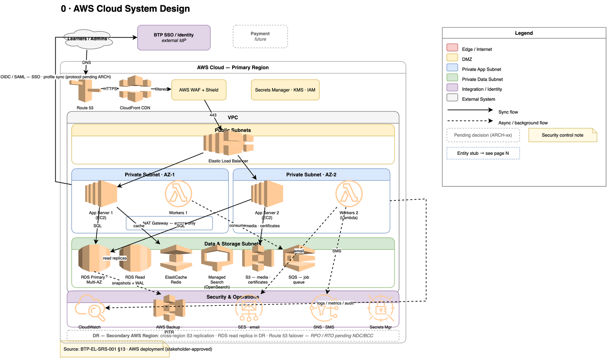

# BTP E-Learning Platform — Architecture Diagrams

---

## 0 · AWS Cloud System Design
Complete cloud deployment on AWS: Route 53 → CloudFront → WAF/Shield → ALB → EC2 app servers across two AZs, Lambda workers via SQS, RDS (Multi-AZ + read replica), ElastiCache, OpenSearch, S3, SES/SNS notifications, CloudWatch/Backup/Secrets Manager, with BTP SSO federation and a cross-region DR plan.

## 1 · System Context
The platform as one box with its actors and external systems — BTP SSO/Identity, government email/SMS gateways, inactive payment stub, monitoring/SIEM.

## 2 · Logical Component Architecture
Internal services across application and data tiers; the **Parent Course → Language Versions** bilingual model is highlighted (BR-001).

## 3 · Network / Deployment Architecture
Five color-coded zones — Edge → DMZ → private app subnet → private data subnet → integration/identity — with the server baseline, security annotations, and environment promotion inset.

## 4 · Core Data Model — Learning Domain
ERD of the learning domain: parent course, language versions, curriculum, enrollment, progress, assessments, and certificates.

## 5 · Core Data Model — Platform & Audit Domain
ERD of the platform domain: users, profiles, admin roles, notifications and delivery logs, audit/login trails, taxonomy, integration mapping, settings.

## 6 · State / Lifecycle Diagram
Status transitions for course language versions, enrollments, and user accounts.

## 7 · Sequence — Auth & SSO
BTP SSO login, self-registration with OTP verification, and account linking.

## 8 · Sequence — Learning Lifecycle
Discover → enroll → learn/progress → assessment → async completion and certificate issuance.

## 9 · Sequence — Content Publishing
Admin creates a parent course once, adds Bangla + English versions, builds curriculum, then publishes and maintains per version.

## 10 · Integration, Observability, Backup & DR
BTP API gateway and async job flow (retry, idempotency, dead-letter), plus SIEM shipping, PITR backups, and DR failover.

---

