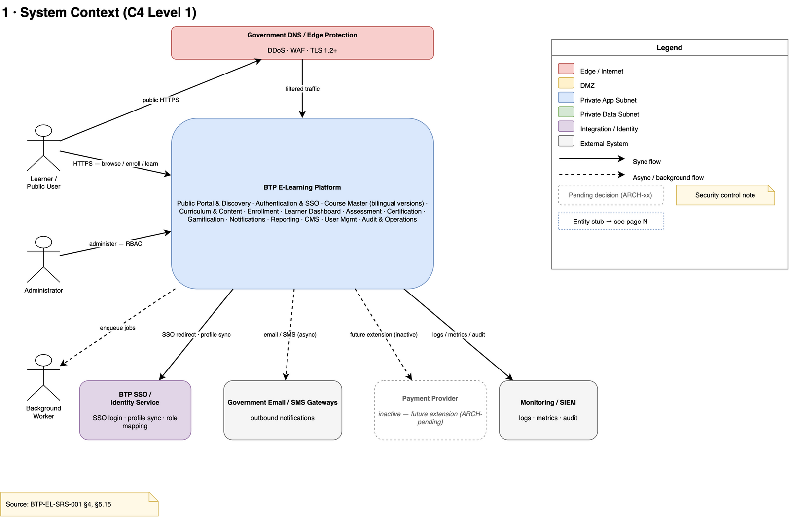
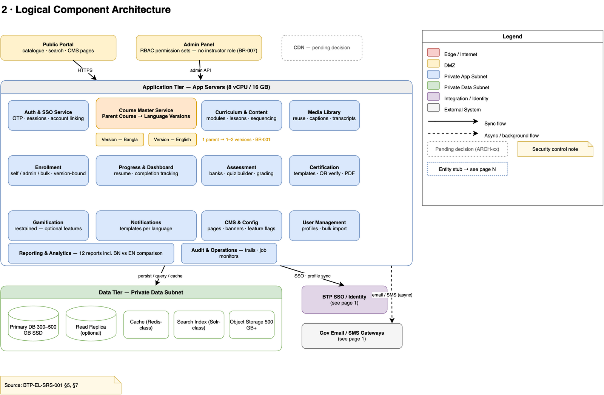
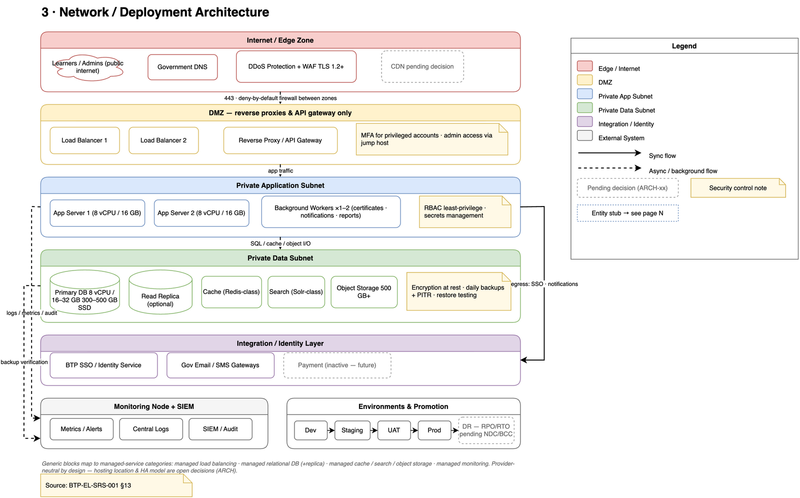
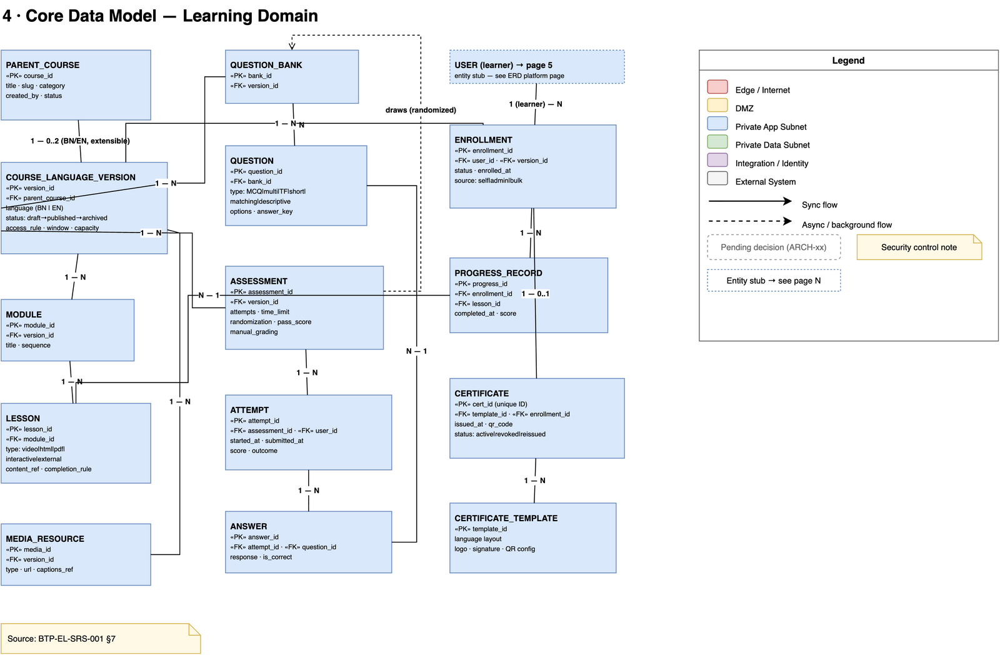
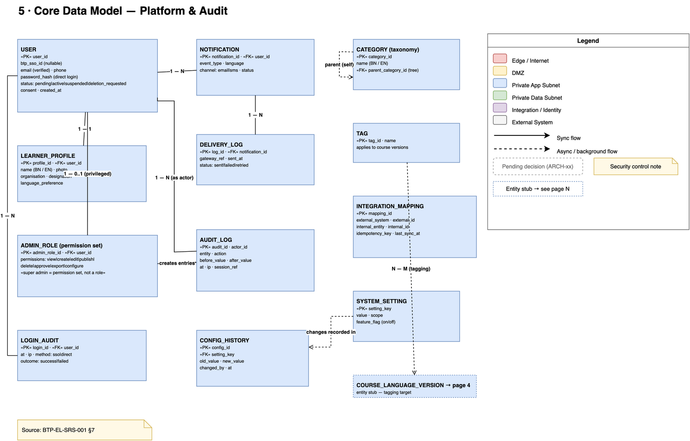
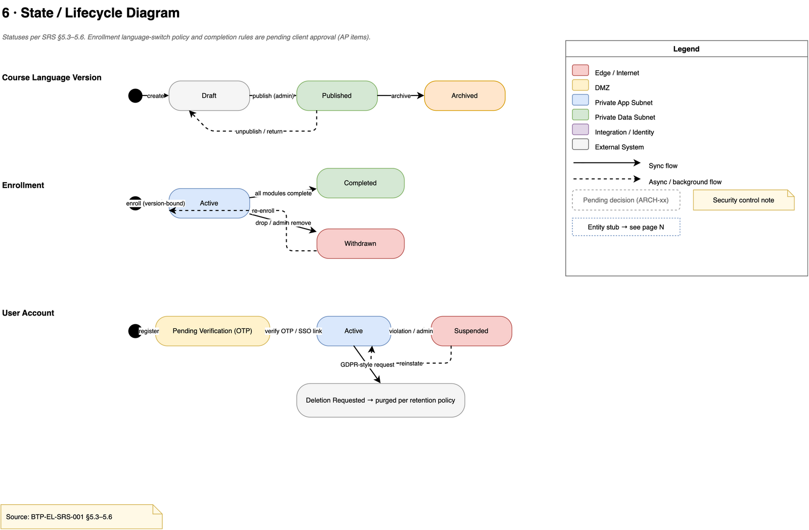
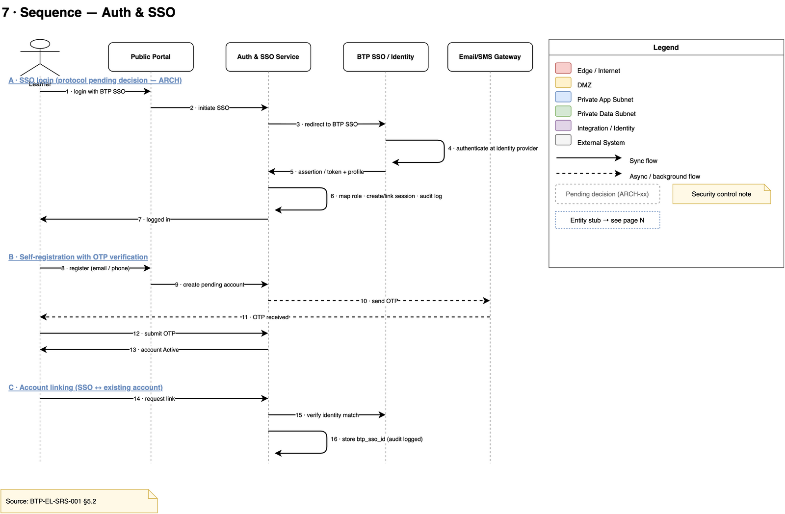
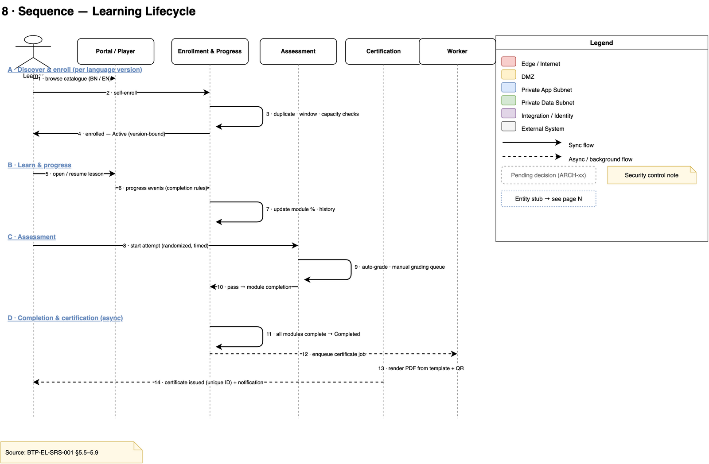
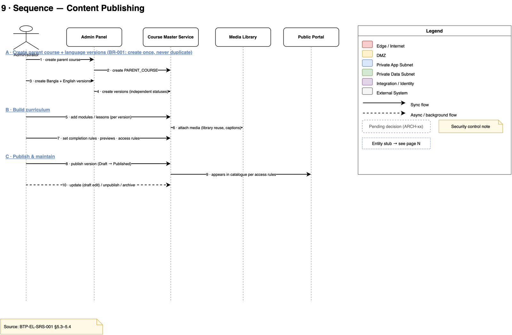
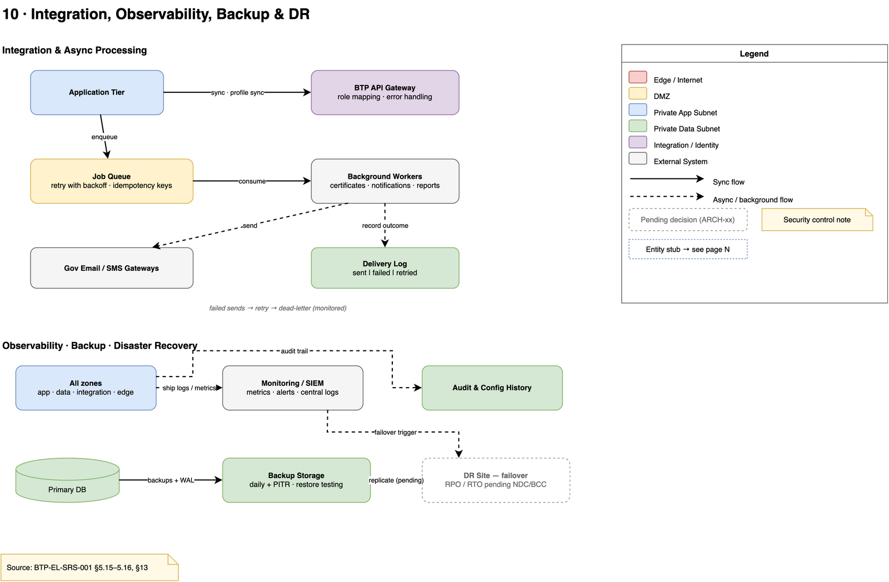

# BTP E-Learning Platform — Architecture Diagrams

---

## 0 · System Context
The platform as one box with its actors and external systems — BTP SSO/Identity, government email/SMS gateways, inactive payment stub, monitoring/SIEM.

## 1 · Logical Component Architecture
Internal services across application and data tiers; the **Parent Course → Language Versions** bilingual model is highlighted (BR-001).

## 2 · Network / Deployment Architecture
Five color-coded zones — Edge → DMZ → private app subnet → private data subnet → integration/identity — with the server baseline, security annotations, and environment promotion inset.

## 3 · Core Data Model — Learning Domain
ERD of the learning domain: parent course, language versions, curriculum, enrollment, progress, assessments, and certificates.

## 4 · Core Data Model — Platform & Audit Domain
ERD of the platform domain: users, profiles, admin roles, notifications and delivery logs, audit/login trails, taxonomy, integration mapping, settings.

## 5 · State / Lifecycle Diagram
Status transitions for course language versions, enrollments, and user accounts.

## 6 · Sequence — Auth & SSO
BTP SSO login, self-registration with OTP verification, and account linking.

## 7 · Sequence — Learning Lifecycle
Discover → enroll → learn/progress → assessment → async completion and certificate issuance.

## 8 · Sequence — Content Publishing
Admin creates a parent course once, adds Bangla + English versions, builds curriculum, then publishes and maintains per version.

## 9 · Integration, Observability, Backup & DR
BTP API gateway and async job flow (retry, idempotency, dead-letter), plus SIEM shipping, PITR backups, and DR failover.

---

## Resource Sizing Estimates (CPU / Memory)

Indicative sizing per registered-user tier, assuming ~8–10% peak concurrency for API/page traffic, **50% of users streaming pre-recorded video concurrently** (served exclusively via CloudFront + S3, HLS adaptive bitrate ~2.5 Mbps avg / 5 Mbps peak 1080p), and Lambda offloading async work (certificates, notifications). Quiz/exam bursts are the DB-heavy path.

| Registered users | Peak concurrent (API) | Streaming (50%) | App tier (EC2, per AZ) | RDS (Multi-AZ) | Read replica | ElastiCache | Search (OpenSearch) |
|---:|---:|---:|---|---|---|---|---|
| 500 | ~50 | 250 streams | 2× 2 vCPU / 4 GB | 2 vCPU / 4 GB | — | 1 vCPU / 1 GB | — (RDS FTS) |
| 1,000 | ~100 | 500 streams | 2× 2 vCPU / 8 GB | 2 vCPU / 8 GB | — | 1 vCPU / 2 GB | optional 1× 2 vCPU / 8 GB |
| 2,000 | ~200 | 1,000 streams | 2× 4 vCPU / 8 GB | 4 vCPU / 16 GB | — | 2 vCPU / 4 GB | 1× 2 vCPU / 8 GB |
| 5,000 | ~500 | 2,500 streams | 2–3× 4 vCPU / 16 GB (ASG) | 8 vCPU / 32 GB | 1× 4 vCPU / 16 GB | 4 vCPU / 8 GB | 2× 2 vCPU / 8 GB |
| 10,000 | ~1,000 | 5,000 streams | 3–4× 8 vCPU / 16 GB (ASG) | 8 vCPU / 32 GB | 1–2× 8 vCPU / 32 GB | 8 vCPU / 16 GB | 3× 2 vCPU / 8 GB |

### Video streaming layer (50% concurrent streams)

| Registered users | Streams | Egress @ 2.5 Mbps avg | Data transfer / hour | Delivered by |
|---:|---:|---:|---:|---|
| 500 | 250 | ~0.6 Gbps | ~280 GB | CloudFront + S3 |
| 1,000 | 500 | ~1.3 Gbps | ~560 GB | CloudFront + S3 |
| 2,000 | 1,000 | ~2.5 Gbps | ~1.1 TB | CloudFront + S3 |
| 5,000 | 2,500 | ~6.3 Gbps | ~2.8 TB | CloudFront + S3 |
| 10,000 | 5,000 | ~12.5 Gbps | ~5.6 TB | CloudFront + S3 |

**Notes**

- **Video never touches the app tier or the database.** Pre-recorded videos are transcoded once at upload (AWS MediaConvert, HLS renditions 360p–1080p) into S3; CloudFront serves all viewer traffic. This is why the app/RDS sizes above are unchanged despite 50% streaming concurrency — serving video from EC2 instead would multiply the app tier by ~50× and is never an option.
- CloudFront absorbs the 12.5 Gbps peak at the 10,000-user tier without provisioning; origin fetches are cache hits >95% for popular course content, so S3/origin egress stays a small fraction of delivery volume.
- **Cost is the real constraint, not capacity:** at the 10,000 tier, 4 h/day of streaming ≈ 22 TB/day ≈ 670 TB/month of CloudFront egress — budget accordingly (volume discounts / CloudFront Security Savings Program apply).
- The SRS §13 baseline (2× 8 vCPU / 16 GB app servers, 8 vCPU / 16–32 GB DB) corresponds to the **5,000–10,000 user** tier — treat it as the provisioning target, with smaller tiers as a staged rollout path.
- Use autoscaling (ASG on CPU ~60% / request count) rather than fixed headroom; minimum 1 node per AZ for HA.
- Exam-week spikes: size the DB for quiz bursts (reads + writes per attempt), pre-scale before known exam windows; everything else can scale elastically.
- These are planning estimates, not contractual capacity figures (SRS lists performance targets as optimization goals, not guarantees).
